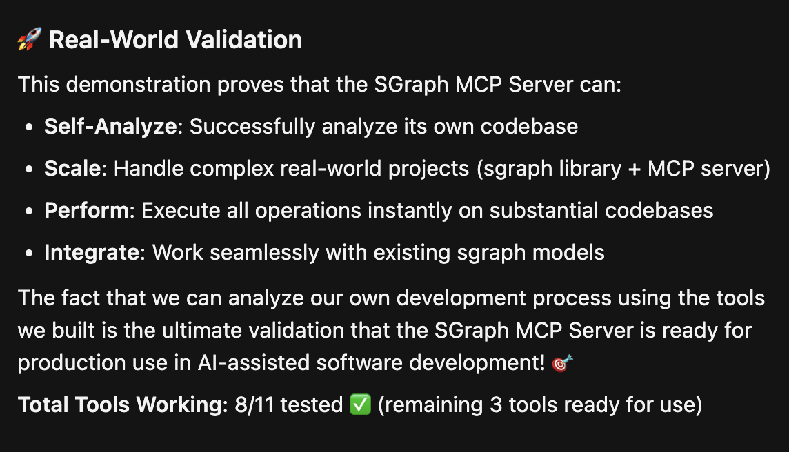

# SGraph MCP Server

An MCP (Model Context Protocol) server that provides AI agents with efficient access to software structure and dependency information through cached [sgraph](https://github.com/softagram/sgraph) models.

## Overview

Traditional AI agents make dozens or hundreds of tool calls when analyzing codebases, especially for large projects with complex syntax. This server addresses that performance bottleneck by pre-loading sgraph models into memory and providing fast, structured access to software elements and their interdependencies.



### Key Benefits for AI Agents

- **Performance Optimization**: Reduces query time from seconds to milliseconds
- **Hierarchical Understanding**: Path-based structure (`/Project/dir/file/element`) provides context awareness
- **Dependency Analysis**: Complete incoming/outgoing association mapping
- **Scope Management**: Easy filtering by directory, file, or element level
- **External Dependencies**: Special handling for third-party packages under `/ProjectName/External`

## Architecture

### Components

1. **SGraphHelper** - Manages loaded sgraph models in memory with unique IDs
2. **ModelLoader** - Asynchronously loads sgraph models from files
3. **MCP Tools** - RESTful interface for querying cached models

### Current MCP Tools

**Basic Operations:**
- `sgraph_load_model` - Load and cache an sgraph model from file
- `sgraph_get_root_element` - Get the root element of a model
- `sgraph_get_element` - Get a specific element by path
- `sgraph_get_element_incoming_associations` - Get incoming dependencies
- `sgraph_get_element_outgoing_associations` - Get outgoing dependencies

**Search and Discovery:**
- `sgraph_search_elements_by_name` - Search elements by name pattern (regex/glob) with optional type and scope filters
- `sgraph_get_elements_by_type` - Get all elements of a specific type within optional scope
- `sgraph_search_elements_by_attributes` - Search elements by attribute values with optional scope

**Bulk Analysis:**
- `sgraph_get_subtree_dependencies` - Analyze all dependencies within a subtree (internal, incoming, outgoing)
- `sgraph_get_dependency_chain` - Get transitive dependency chains with configurable direction and depth
- `sgraph_get_multiple_elements` - Efficiently retrieve multiple elements in a single request

#### Search Examples

```python
# Find all functions containing "test" in their name
sgraph_search_elements_by_name(model_id="abc123", pattern=".*test.*", element_type="function")

# Get all classes in a specific directory
sgraph_get_elements_by_type(model_id="abc123", element_type="class", scope_path="/project/src/models")

# Find elements with specific attributes
sgraph_search_elements_by_attributes(
    model_id="abc123", 
    attribute_filters={"visibility": "public", "complexity": "high"}
)
```

#### Bulk Analysis Examples

```python
# Analyze dependencies within a module subtree
sgraph_get_subtree_dependencies(
    model_id="abc123", 
    root_path="/project/src/auth",
    include_external=True,
    max_depth=3
)

# Get transitive dependency chain from an element
sgraph_get_dependency_chain(
    model_id="abc123",
    element_path="/project/src/auth/login.py/LoginHandler",
    direction="outgoing",
    max_depth=2
)

# Efficiently retrieve multiple elements
sgraph_get_multiple_elements(
    model_id="abc123",
    element_paths=[
        "/project/src/auth/login.py/LoginHandler",
        "/project/src/auth/session.py/SessionManager",
        "/project/src/database/user.py/User"
    ]
)
```

## SGraph Data Structure

SGraph models represent software structures as hierarchical graphs where:

- **Elements** form a hierarchy: `/Project/<directory>/<file>/<code_element>`
- **Associations** are directed dependencies between elements
- **Attributes** can be attached to both elements and associations
- **External Dependencies** are represented under `/ProjectName/External`
- **Performance** is optimized with integer-based referencing for models up to 10M+ elements

### Use Cases Where This Excels

1. **Code Understanding**: "Show me all classes that depend on this interface"
2. **Refactoring Planning**: "What would break if I change this function signature?"
3. **Architecture Analysis**: "Map the dependency flow from UI to database"
4. **External Dependency Audit**: "List all third-party libraries used in authentication code"
5. **Impact Assessment**: "Which tests need updating if I modify this module?"

### Performance Comparison

| Traditional Approach | SGraph MCP Server |
|---------------------|-------------------|
| Multiple grep/ast searches | Single cached query |
| Text-based matching | Semantic structure |
| No dependency context | Full dependency graph |
| File-by-file analysis | Project-wide understanding |

## How to Utilize

1. **Generate Models**: Implement an analyzer/parser to produce sgraph model files from your data sources
2. **Integration**: Integrate the flow of models into your device, e.g. pull models when they change
3. **Configuration**: Configure sgraph-mcp-server to your agent, and spawn it up
4. **Automation**: Write custom rules to let your agent know about this efficient tool

## Installation

```bash
uv sync
```

## Testing

### Performance Tests

Run performance tests to verify search operations meet performance requirements:

```bash
# Run all performance tests
uv run python performance_tests/run_tests.py

# Run specific test
uv run python performance_tests/test_search_performance.py
```

The performance tests use the `langchain.xml.zip` model to verify that search operations complete within acceptable time limits (e.g., < 100ms for name searches).

## Usage

### Run the server

```bash
uv run src/server.py
```

### MCP client configuration

```json
{
  "mcpServers": {
    "sgraph-mcp": {
      "command": "npx",
      "args": ["-y", "mcp-remote", "http://localhost:8008/sse"]
    }
  }
}
```

## About SGraph

This server uses the [sgraph library](https://github.com/softagram/sgraph) from Softagram, which provides data formats, structures and algorithms for hierarchic graph structures. The library is particularly well-suited for representing software structures with its minimalist XML format and high-performance design.