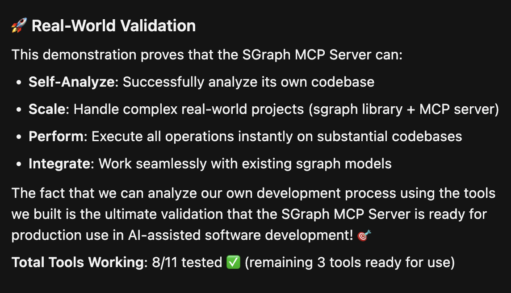

# SGraph MCP Server

An MCP (Model Context Protocol) server that provides AI agents with efficient access to software structure and dependency information through cached [sgraph](https://github.com/softagram/sgraph) models.

## Overview

Traditional AI agents make dozens or hundreds of tool calls when analyzing codebases, especially for large projects with complex syntax. This server addresses that performance bottleneck by pre-loading sgraph models into memory and providing fast, structured access to software elements and their interdependencies.



### Key Benefits for AI Agents

- **Performance Optimization**: Reduces query time from seconds to milliseconds
- **Hierarchical Understanding**: Path-based structure (`/Project/dir/file/element`) provides context awareness
- **Dependency Analysis**: Complete incoming/outgoing association mapping
- **Scope Management**: Easy filtering by directory, file, or element level
- **External Dependencies**: Special handling for third-party packages under `/ProjectName/External`

## Architecture

The sgraph-mcp-server uses a **modular architecture** designed for maintainability, testability, and extensibility:

### Components

1. **Core Layer** (`src/core/`)
   - **ModelManager** - Model loading, caching, and lifecycle management  
   - **ElementConverter** - SElement to dictionary conversion utilities

2. **Service Layer** (`src/services/`)
   - **SearchService** - Search algorithms (by name, type, attributes)
   - **DependencyService** - Dependency analysis and subtree operations
   - **OverviewService** - Model structure overview generation

3. **Tools Layer** (`src/tools/`)
   - **ModelTools** - Model loading and overview MCP tools
   - **SearchTools** - Search-related MCP tools  
   - **AnalysisTools** - Dependency analysis MCP tools
   - **NavigationTools** - Element navigation MCP tools

4. **Utils Layer** (`src/utils/`)
   - **Logging** - Centralized logging configuration
   - **Validators** - Input validation and security checks

See [ARCHITECTURE.md](ARCHITECTURE.md) for detailed design documentation.

### MCP Tools by Profile

#### Claude Code Profile (7 tools, plain text output)

All Claude Code tools return **plain text using TOON line notation** instead of JSON, minimizing token usage.

| Tool | Purpose | Output Format |
|------|---------|---------------|
| `sgraph_load_model` | Load and cache a model | JSON (metadata only) |
| `sgraph_search_elements` | Find elements by name pattern | `N/M matches` + `/path [type] name` lines |
| `sgraph_get_element_dependencies` | Query incoming/outgoing deps | `-> /target (type)` or `/source (type) ->` |
| `sgraph_get_element_structure` | Explore hierarchy without reading source | Indented `/path [type] name` tree |
| `sgraph_analyze_change_impact` | Impact analysis with warnings | Summary + cycle/hub warnings + paths by level |
| `sgraph_audit` | Architectural health checks | Cycles, hub modules, summary metrics |

Key features:
- **`include_descendants`** on dependencies: shows which child element owns each dependency using relative paths (no leading `/`)
- **`result_level`** aggregation: same data at function/file/directory/repository granularity
- **`scope_path`** filtering: limit searches to subtrees, with configurable default scope

See [SGRAPH_FOR_CLAUDE_CODE.md](SGRAPH_FOR_CLAUDE_CODE.md) for full tool reference, output examples, and workflows.

#### Legacy Profile (14 tools, JSON output)

**Basic Operations:**
- `sgraph_load_model` - Load and cache an sgraph model from file
- `sgraph_get_root_element` - Get the root element of a model
- `sgraph_get_element` - Get a specific element by path
- `sgraph_get_element_incoming_associations` - Get incoming dependencies
- `sgraph_get_element_outgoing_associations` - Get outgoing dependencies

**Search and Discovery:**
- `sgraph_search_elements_by_name` - Search elements by name pattern (regex/glob) with optional type and scope filters
- `sgraph_get_elements_by_type` - Get all elements of a specific type within optional scope
- `sgraph_search_elements_by_attributes` - Search elements by attribute values with optional scope

**Bulk Analysis:**
- `sgraph_get_subtree_dependencies` - Analyze all dependencies within a subtree (internal, incoming, outgoing)
- `sgraph_get_dependency_chain` - Get transitive dependency chains with configurable direction and depth
- `sgraph_get_multiple_elements` - Efficiently retrieve multiple elements in a single request
- `sgraph_get_model_overview` - Get hierarchical overview of model structure with configurable depth
- `sgraph_get_high_level_dependencies` - Get module-level dependencies aggregated at directory level with metrics

## SGraph Data Structure

SGraph models represent software structures as hierarchical graphs where:

- **Elements** form a hierarchy: `/Project/<directory>/<file>/<code_element>`
- **Associations** are directed dependencies between elements
- **Attributes** can be attached to both elements and associations
- **External Dependencies** are represented under `/ProjectName/External`
- **Performance** is optimized with integer-based referencing for models up to 10M+ elements

### Use Cases Where This Excels

1. **Code Understanding**: "Show me all classes that depend on this interface"
2. **Refactoring Planning**: "What would break if I change this function signature?"
3. **Architecture Analysis**: "Map the dependency flow from UI to database"
4. **External Dependency Audit**: "List all third-party libraries used in authentication code"
5. **Impact Assessment**: "Which tests need updating if I modify this module?"

### Performance Comparison

| Traditional Approach | SGraph MCP Server |
|---------------------|-------------------|
| Multiple grep/ast searches | Single cached query |
| Text-based matching | Semantic structure |
| No dependency context | Full dependency graph |
| File-by-file analysis | Project-wide understanding |

## How to Utilize

1. **Generate Models**: Implement an analyzer/parser to produce sgraph model files from your data sources
2. **Integration**: Integrate the flow of models into your device, e.g. pull models when they change
3. **Configuration**: Configure sgraph-mcp-server to your agent, and spawn it up
4. **Automation**: Write custom rules to let your agent know about this efficient tool

## Installation

```bash
uv sync
```

## Testing

The project includes comprehensive tests organized by type:

### Run All Tests
```bash
# Run all tests (unit, integration, performance)
uv run python tests/run_all_tests.py

# Run specific test types
uv run python tests/run_all_tests.py unit
uv run python tests/run_all_tests.py integration  
uv run python tests/run_all_tests.py performance
```

### Test Structure
- **Unit Tests** (`tests/unit/`) - Test individual components in isolation
- **Integration Tests** (`tests/integration/`) - Test component interactions and workflows  
- **Performance Tests** (`tests/performance/`) - Validate performance targets and regressions

### Legacy Performance Tests
The original performance tests verify that search operations meet performance requirements:

```bash
# Run original performance test suite
uv run python tests/performance/run_tests.py

# Run specific legacy test
uv run python tests/performance/test_search_performance.py
```

Performance tests use real models to verify operations complete within acceptable time limits (e.g., < 100ms for name searches).

## Usage

### Profiles

The server supports multiple profiles optimized for different use cases:

| Profile | Tools | Output | Use Case |
|---------|-------|--------|----------|
| `legacy` | 14 | JSON | Full tool set (backwards compatible, default) |
| `claude-code` | 7 | Plain text (TOON) | AI-assisted development (token-optimized) |

### Run the server

```bash
# Default (legacy profile with all 14 tools)
uv run python -m src.server

# Claude Code optimized (7 tools, plain text TOON output)
uv run python -m src.server --profile claude-code

# Explicit legacy
uv run python -m src.server --profile legacy
```

### MCP client configuration

```json
{
  "mcpServers": {
    "sgraph-mcp": {
      "command": "npx",
      "args": ["-y", "mcp-remote", "http://localhost:8008/sse"]
    }
  }
}
```

For Claude Code or Cursor, you can also use a `.mcp.json` file in your project root:

```json
{
  "mcpServers": {
    "sgraph": {
      "command": "npx",
      "args": ["-y", "mcp-remote", "http://localhost:8008/sse"]
    }
  }
}
```

### Profile Documentation

- **Claude Code**: See [SGRAPH_FOR_CLAUDE_CODE.md](SGRAPH_FOR_CLAUDE_CODE.md) for tool reference, output examples, and workflows

## About SGraph

This server uses the [sgraph library](https://github.com/softagram/sgraph) from Softagram, which provides data formats, structures and algorithms for hierarchic graph structures. The library is particularly well-suited for representing software structures with its minimalist XML format and high-performance design.